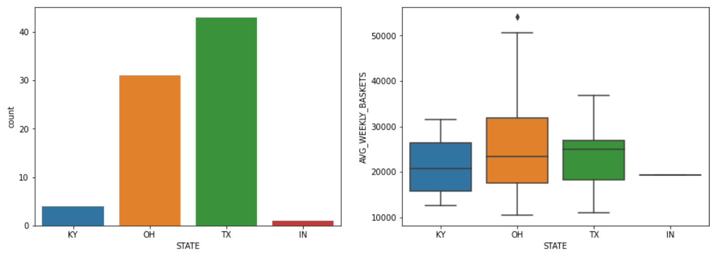
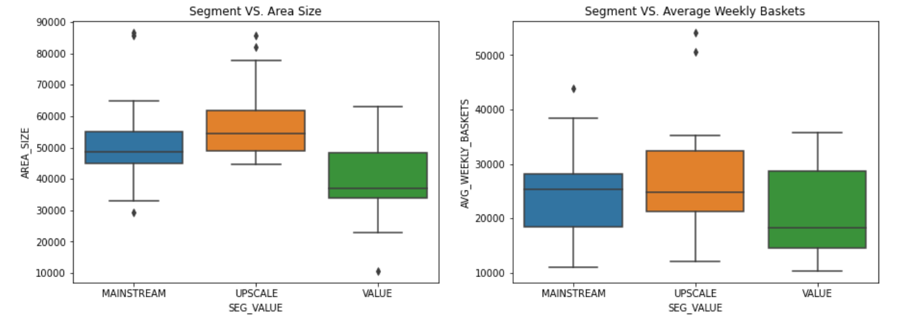
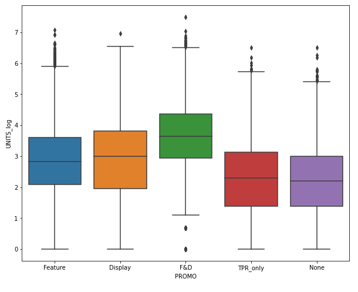
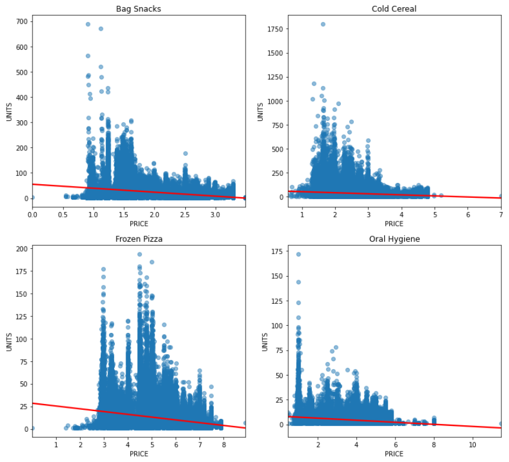
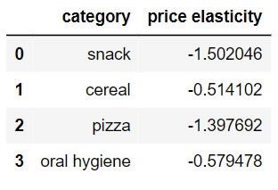
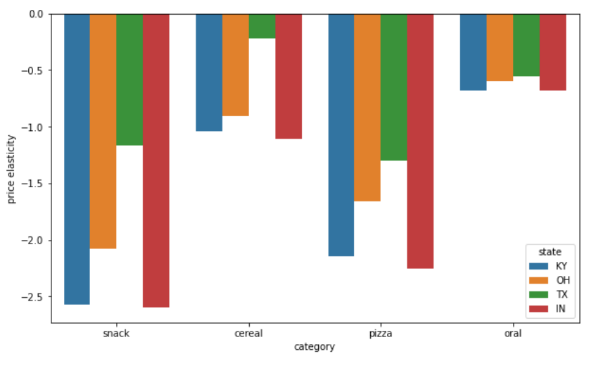

# Explore Dunnhumby Breakfast at the Frat Data 
There are three datasets given: store, products, and transactions.
 

### Store EDA
The data is from 79 stores and the stores are locates in 4 states: Kentucky (KY), Ohio (OH), Texas (TX), and Indiana (IN).

Texas is the state with the most stores and Indiana has the least. In fact, it seems like there is only one 
store located in Indiana. Regarding the average weekly basket sales, Texas has the highest average average weekly basket sales, 
then Ohio next but with some higher number of average weekly baskets.

The stores are categorized into three different segments: Mainstream, Upscale and Value. Stores that are defined as Upscale 
have the biggest area size and Value generally have a smaller area size. Looking at the average weekly baskets for each segment, it seems as if the size of 
the area might have an effect on the sales of the basket which makes sense as bigger the area the more products they 
provide and more things to buy. 

Then significance of the variable sales area size and segments in differentiating the stores' average weekly baskets is determined using ANOVA statistics. 
For both the P-value is found to be above 0.05, hence we accept the null hypothesis that there's no difference between the means and 
conclude that a significant difference doesn't exist

### Promotion
The effect of promotion to the units sold is looked into using three variables : 
* **Feature**: product was in in-store circular
* **Display**: product was a part of in-store promotional display
* **TPR_only**: temporary price reduction only (i.e., shelf tag only no other promotions)

Using these variables a new variable Promotion was created, in order to understand the impact on unit sales, 
and to also consider the most effective promotional strategy.

In creating a boxplot of the logarithm of units sold against promotion, it is clear that there 
is a positive correlation between these variables. The number of units sold increases if the 
product received either Display or Feature promotion, and even more if it received both. 
Moreover, product Displays lead to more sales than in-store circulars (Feature). On the other hand, products that only recieved
priced reduction (TPR_only) lead to similar sales to those of the products that has no promotions.

Regression trees for predicting the number of units sold with Promotions by different 
Categories, confirm that the most effective promotional strategy is to use both Display and 
Feature. 

### Price Elasticity 
The price elasticity of demand is the responsiveness of units sold to price changes. When the 
absolute value is greater than 1, the demand is considered elastic - sensitive to price changes. 
If it’sless than 1, demand is inelastic - insensitive to price changes. 

Initially, to get a rough idea, for each category regression plots are made to see how the demand of the product changes
with the change in price. 

Then the price elasticity is found for each category. The category Oral Hygiene Products had the lowest average elasticity, which makes sense, as 
goods in this category are considered necessities and consumers are likely to purchase them 
despite changes in price. The category with the highest average elasticity was Bag Snacks. This 
is also logical as these are the least essential products, shown by the fact that price changes 
have a large impact on sales.

Price elasticity is further examined by the states. 

Looking at the bar graph above, one can know that despite the difference in the range of price 
elasticities, for all categories, the order of 
the elasticity in the different states remain 
consistent, with Indiana having the highest 
price-elasticity and Texas having the lowest. 
This might be due to the types of stores 
where transactions were made. Previously, in the Store section it is found that 
Texas and 
Ohio - the states with inelastic demands, 
have more total transactions as well as 
transactions from upscale stores which 
Indiana and Kentucky do not. This 
potentially explains Indiana’s price-elasticity 
as the data comes only from one type of 
store - mainstream.

## Conlusion 
Through the use of linear regression and regression trees it is safe to say that using both promotions 
types together consistently increases units and visits. Furthermore, oral hygiene products have 
the lowest price elasticity, while bag snacks have the highest price elasticity and Indiana as a 
state has the highest mean price elasticity and Texas has the lowest. While I have not done it in this report, it would
be interesting to see the price elasticity for the brands. 

